# NFL Analytics Portfolio

A collection of football analytics notebooks demonstrating advanced statistical methods, machine learning, and tracking data analysis — built as a portfolio for NFL football operations roles.

## Overview

This portfolio covers four analytical areas spanning play-by-play data, player tracking (NFL Big Data Bowl 2023), and PFF scouting data. Each notebook contains reproducible analysis with real findings that translate directly to on-field strategy and personnel evaluation.

Notebooks bridge the **nflfastR (R) ecosystem to Python** — data loaded via `nfl_data_py` and feature engineering ported from canonical R workflows.

---

## Notebooks

### [01 · Personnel Package Efficiency Analysis](notebooks/01_personnel_efficiency.ipynb)

**Data**: nflfastR 2024 season PBP (33,336 plays)

Analyzes how offensive personnel groupings affect play efficiency across the league, with a Cowboys-specific deep dive.

**Key Findings**:
- 22 personnel yields the highest EPA/play (+0.063), outperforming the more common 11 personnel
- **Cowboys use 11 personnel on 71% of plays** vs. 63% league average — the highest single-package reliance in the NFL
- **Personnel Predictability Index**: Cowboys rank among the most predictable teams for run/pass tendency by personnel — defenses can anticipate play type before the snap
- Optimal matchup: 22 personnel vs. 2-4-5 defense → +0.284 EPA (highest advantage in the matrix)

| Chart | Description |
|-------|-------------|
| 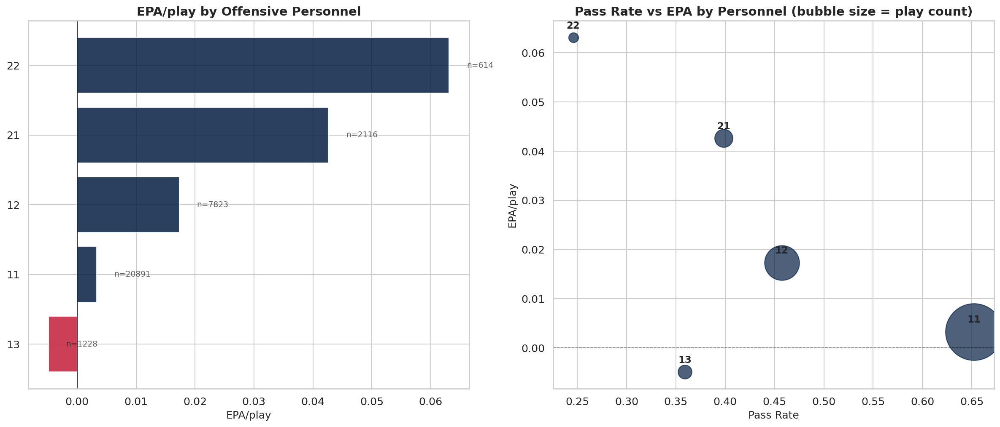 | EPA/play by offensive personnel grouping |
| 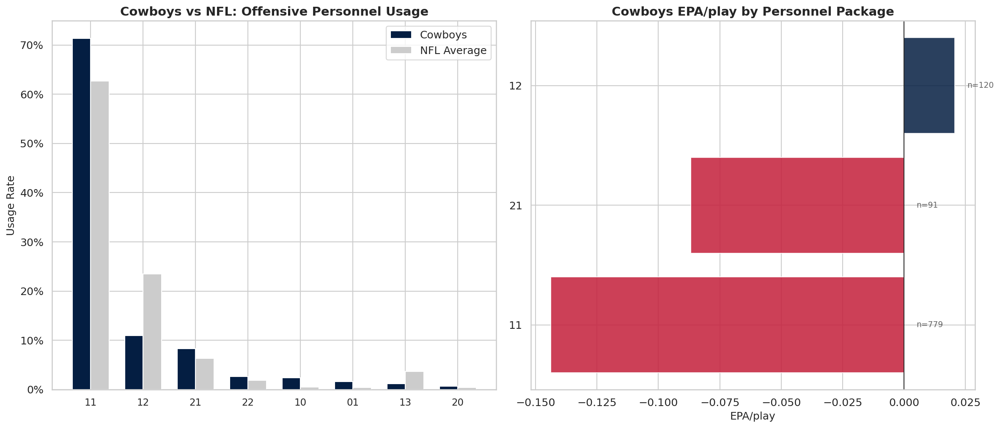 | Cowboys usage vs. league average |
| 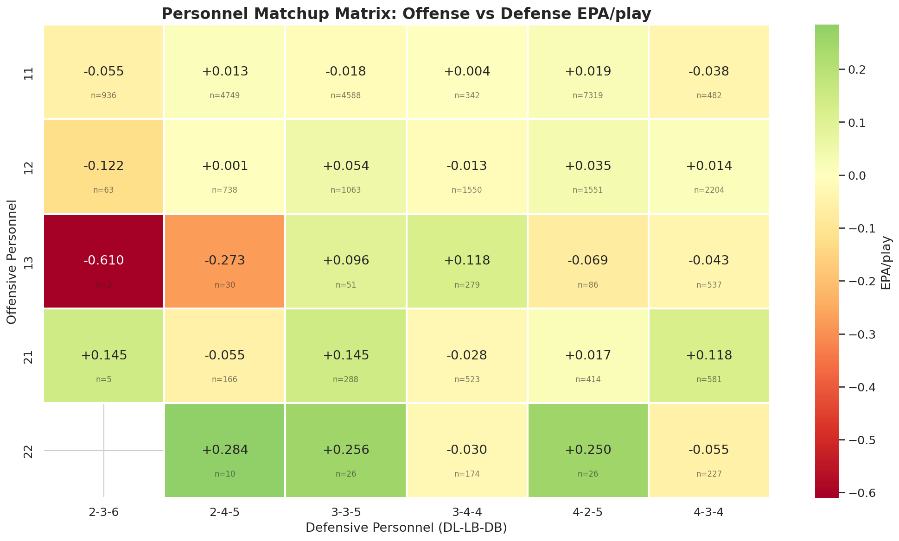 | Offensive × defensive personnel EPA heatmap |
| 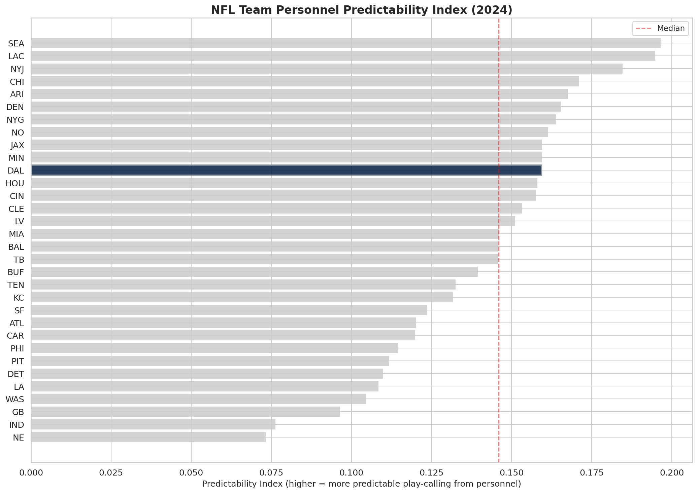 | Personnel predictability ranking by team |

---

### [02 · Pass Rush Win Rate & Individual Matchup Analysis](notebooks/02_pass_rush_matchups.ipynb)

**Data**: BDB 2023 tracking data (weeks 1–4, 4.35M rows) + PFF scouting data (188,254 records)

Computes Pass Rush Win Rate (PRWR) for individual rushers from raw tracking coordinates, and constructs OL vs. DL matchup matrices.

**Key Findings**:
- **Myles Garrett leads all rushers with 24.0% PRWR** (208 rushes, 12 sacks) — tracking data confirms what the eye test shows
- Time-to-pressure curves: pressure plays and non-pressure plays diverge clearly starting at 1.5 seconds post-snap
- **Pressure cuts completion rate from 65.1% → 35.1%** and average yards gained from 8.1 → 3.9
- Individual matchup matrix enables head-to-head OL/DL comparison for game planning

| Chart | Description |
|-------|-------------|
| 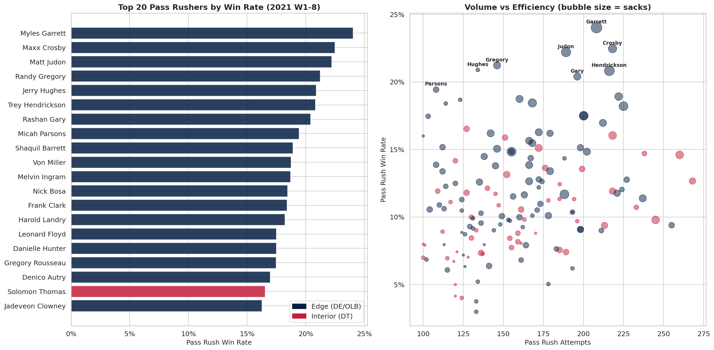 | Pass Rush Win Rate ranking (top 148 qualified rushers) |
| 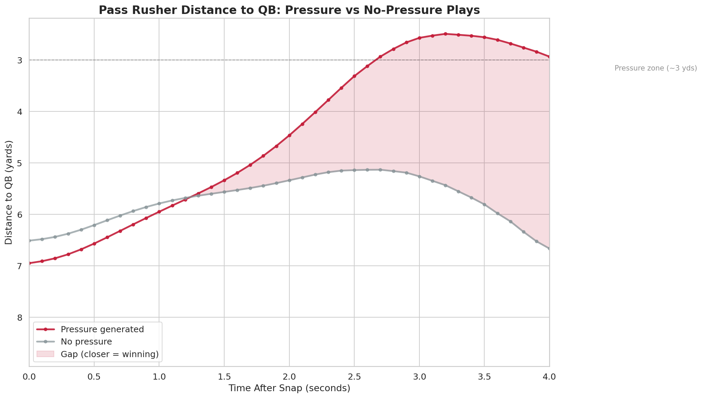 | QB distance from nearest rusher over time |
| 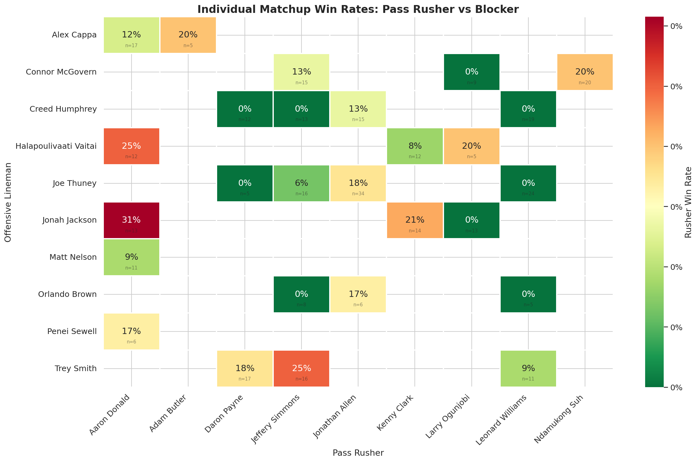 | Individual OL vs. DL win rate matrix |

---

### [03 · Motion-Based Coverage Classification](notebooks/03_motion_coverage.ipynb)

**Data**: BDB 2023 tracking data (all 8 weeks, ~8.7M rows) + PFF scouting + plays.csv (coverage labels)

Detects pre-snap motion and constructs novel features that allow a machine learning model to classify Man vs. Zone coverage — simulating what a QB reads before the snap.

**Novel Metric — DB Follow Score**: Pearson correlation between the motion player's lateral displacement and the nearest DB's lateral displacement. Quantifies whether a DB is mirroring the motion player (Man-like) or maintaining zone responsibility (Zone-like).

**Key Findings**:
- Full model (+ motion reaction features): **AUC 0.820**, Accuracy 0.774, F1 macro 0.731
- Baseline (context features only): AUC 0.746 — **motion features add +0.074 AUC**
- Counterintuitively, Zone DBs have *higher* follow scores (0.545) than Man DBs (0.422) — Zone defenders shift with motion to maintain alignment, not chase
- lateral_mirror score is higher in Man coverage (0.375 vs. 0.276) — Man DBs move equal distances as the motion player
- 14.9% of misclassified "Man-like Zone" plays are Cover-3, suggesting matchup zone tendencies

| Chart | Description |
|-------|-------------|
| 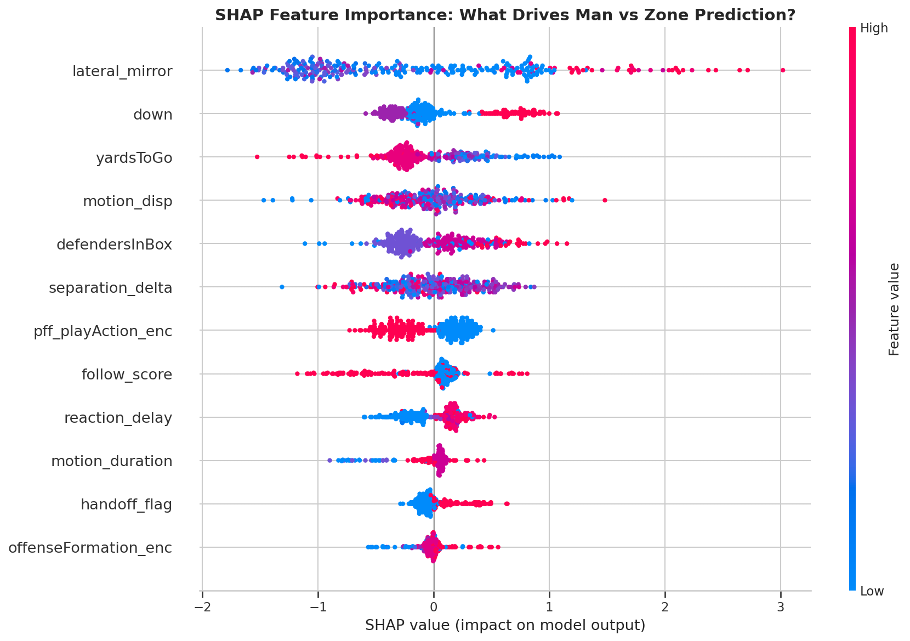 | SHAP feature importance (beeswarm plot) |
| 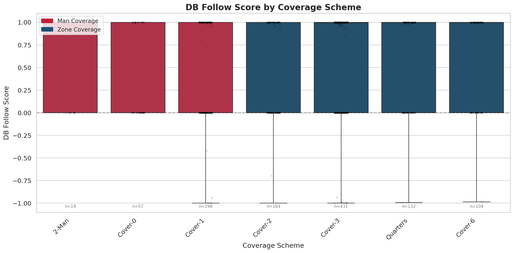 | DB follow score distribution: Man vs. Zone |
| 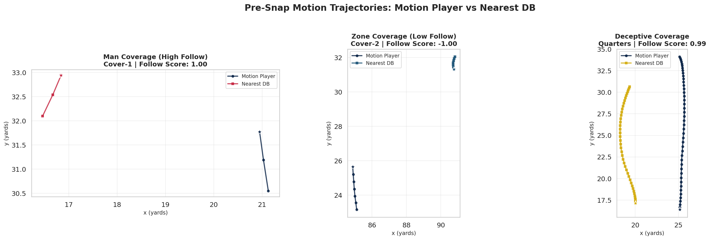 | Sample pre-snap motion paths with DB responses |
| 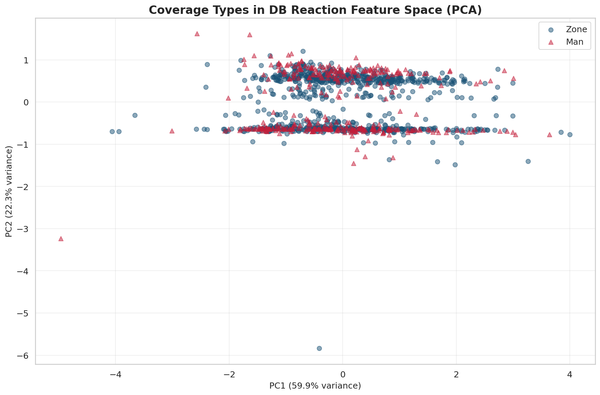 | PCA of motion features — coverage cluster separation |

---

### [04 · Pre-Snap Coverage Shell Classification & Disguise Detection](notebooks/04_shell_classification.ipynb)

**Data**: BDB 2023 tracking data (all 8 weeks) + PFF scouting (safety alignment) + plays.csv

Builds a rule-based classifier for 1-High vs. 2-High safety shells from pre-snap safety coordinates, then detects *coverage disguise* — when the pre-snap shell does not match the actual post-snap coverage.

**Key Findings**:
- Rule-based shell classifier: **74.4% accuracy** (depth ≥ 5 yd, lateral separation ≥ 12 yd threshold)
- **25.6% of all plays involve disguise** — defenses show one shell pre-snap and rotate to another post-snap
- Cover-2 is the most disguised coverage (48.5% of Cover-2 plays show a different pre-snap shell), followed by Quarters (41.9%)
- **Team disguise rankings (2021, Weeks 1–8)**: ATL (39.3%), TB (38.6%), NYG (35.9%) most aggressive disguisers; HOU (8.2%), LV (15.1%), MIN (15.9%) most honest
- QB decision tree accuracy: **1-High + Zone → Cover-3 (100%)**, 1-High + Man → Cover-1 (94.9%), 2-High + Man → 2-Man (100%)
- Disguise effect is statistically non-significant overall (p = 0.67) — disguising *which* coverage ≠ automatic success

| Chart | Description |
|-------|-------------|
| 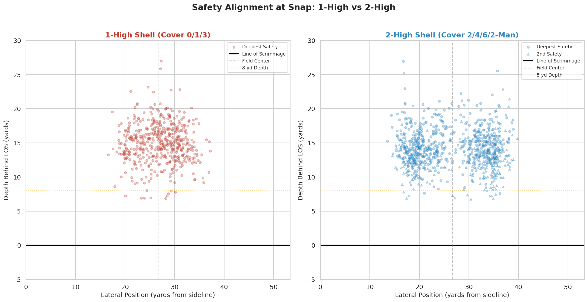 | Safety pre-snap positions colored by shell type |
| 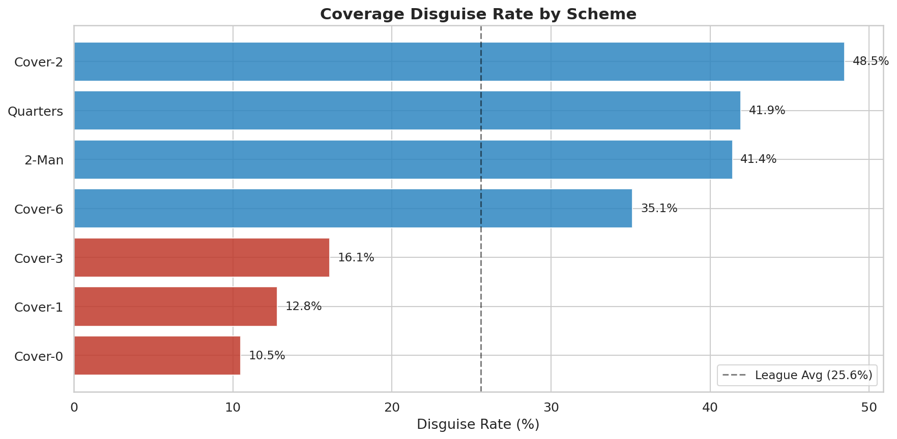 | Disguise rate per coverage type |
| 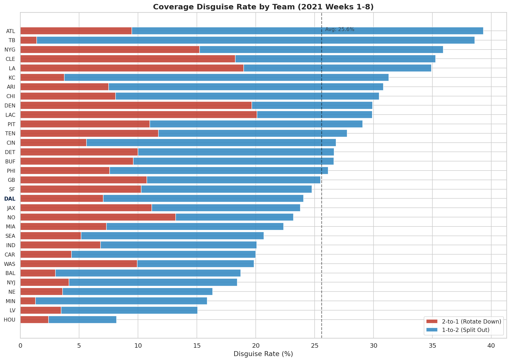 | 32-team disguise rate ranking |
| 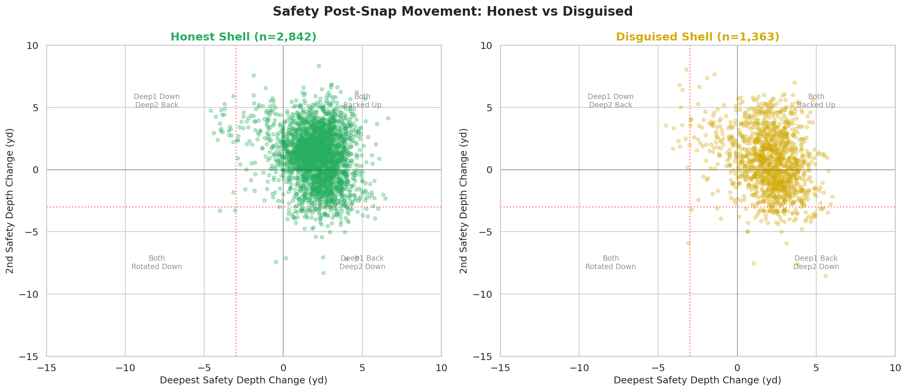 | Post-snap safety movement vectors on disguise plays |

---

## Data Sources

| Source | Description |
|--------|-------------|
| [nflfastR](https://www.nflfastr.com/) / [nfl_data_py](https://github.com/nflverse/nfl_data_py) | Play-by-play data, EPA, game context (2024 season) |
| [NFL Big Data Bowl 2023](https://www.kaggle.com/competitions/nfl-big-data-bowl-2023) | Player tracking data — 2021 season, Weeks 1–8 (920 MB) |
| [PFF Scouting Data](https://www.kaggle.com/competitions/nfl-big-data-bowl-2023/data) | Blocking assignments, pass rush results, coverage alignments |

> **Note**: BDB tracking data and CSV source files are excluded from this repository (`.gitignore`). Notebooks can be re-executed by downloading the BDB 2023 dataset from Kaggle and placing files in `data/bdb2023/`.

---

## Tech Stack

- **Language**: Python 3.10+
- **Data**: `nfl_data_py`, `pandas`, `numpy`
- **ML**: `scikit-learn`, `xgboost`, `shap`, `scipy`
- **Visualization**: `matplotlib`, `seaborn`
- **Notebooks**: `jupyter`, `nbformat`

```
pip install -r requirements.txt
```

---

## Repository Structure

```
nfl-analytics/
├── notebooks/
│   ├── 01_personnel_efficiency.ipynb   # Personnel package EPA analysis
│   ├── 02_pass_rush_matchups.ipynb     # Pass rush win rate & tracking matchups
│   ├── 03_motion_coverage.ipynb        # Motion-based Man/Zone classification
│   ├── 04_shell_classification.ipynb   # Pre-snap shell classification & disguise
│   └── *.png                           # Generated charts
├── requirements.txt
└── data/bdb2023/                       # Not tracked (download from Kaggle)
```
